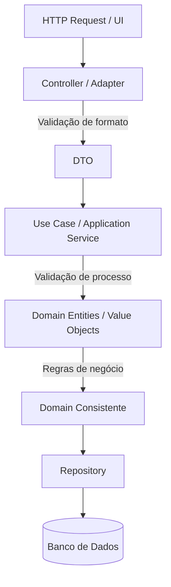

# Fluxo de Validação em Clean Architecture / Hexagonal

Este diagrama mostra **onde cada tipo de validação acontece** dentro de uma arquitetura bem estruturada.

A ideia central é separar responsabilidades:

* **Interface / Adapter** → valida formato de dados
* **Application / Use Case** → valida fluxo da aplicação
* **Domain** → valida regras de negócio

---

# Diagrama do fluxo de validação



---

# Explicação por camada

## 1. Interface / Adapter (Controller)

Responsável por **receber dados externos**.

Exemplos de validações aqui:

* campo obrigatório
* formato de email
* CPF com máscara válida
* número positivo
* JSON bem formado

Exemplo em PHP:

```php
class CriarUsuarioController
{
    public function executar(array $request)
    {
        if (empty($request['email'])) {
            throw new InvalidArgumentException("Email obrigatório");
        }

        if (!filter_var($request['email'], FILTER_VALIDATE_EMAIL)) {
            throw new InvalidArgumentException("Email inválido");
        }

        $dto = new CriarUsuarioDTO(
            $request['nome'],
            $request['email']
        );

        return $this->useCase->executar($dto);
    }
}
```

Responsabilidade principal:

✔ limpar dados externos
✔ evitar entrada de dados inválidos no sistema

---

## 2. DTO (Data Transfer Object)

O DTO transporta dados entre camadas.

Ele pode:

* representar entrada de API
* transportar dados para o Use Case

Exemplo:

```php
class CriarUsuarioDTO
{
    public function __construct(
        public string $nome,
        public string $email
    ) {}
}
```

DTOs **não possuem regra de negócio**.

---

## 3. Use Case (Application Layer)

Aqui acontece a **orquestração do fluxo da aplicação**.

Validações comuns:

* verificar se entidade existe
* verificar permissões
* coordenar serviços

Exemplo:

```php
class CriarPedidoUseCase
{
    public function executar(CriarPedidoDTO $dto)
    {
        $cliente = $this->clienteRepositorio->buscar($dto->clienteId);

        if (!$cliente) {
            throw new Exception("Cliente não encontrado");
        }

        $pedido = new Pedido($cliente);

        $this->pedidoRepositorio->salvar($pedido);
    }
}
```

Responsabilidade:

✔ coordenar regras
✔ chamar o domínio

---

## 4. Domínio

O domínio é responsável por **garantir a consistência do sistema**.

Aqui ficam:

* entidades
* value objects
* regras de negócio

Exemplo:

```php
class CPF
{
    public function __construct(private string $cpf)
    {
        if (!self::valido($cpf)) {
            throw new InvalidArgumentException("CPF inválido");
        }
    }

    private static function valido(string $cpf): bool
    {
        return strlen($cpf) === 11;
    }
}
```

Regra fundamental:

> **Um objeto de domínio nunca deve existir em estado inválido.**

---

## 5. Repository

O repository conecta o domínio com a infraestrutura.

Responsabilidades:

* persistência
* consultas
* mapeamento de entidades

Exemplo:

```php
interface PedidoRepository
{
    public function salvar(Pedido $pedido): void;
}
```

Implementação:

```php
class PedidoRepositoryMySQL implements PedidoRepository
{
    public function salvar(Pedido $pedido): void
    {
        // persistência no banco
    }
}
```

---

# Fluxo completo na prática

Exemplo de requisição criando um pedido:

```
POST /pedidos
{
  "clienteId": 10,
  "produto": "Notebook",
  "quantidade": 1
}
```

Fluxo:

```
Controller
 ↓ valida formato

DTO
 ↓ transporta dados

Use Case
 ↓ coordena processo

Domínio
 ↓ valida regra de negócio

Repository
 ↓ persiste

Banco
```

---

# Benefícios dessa separação

Quando essa organização é respeitada:

✔ domínio fica protegido
✔ código fica mais testável
✔ regras de negócio ficam centralizadas
✔ sistema fica menos acoplado

---

# Regra prática (resumo)

| Camada               | Tipo de validação         |
| -------------------- | ------------------------- |
| Controller / Adapter | valida formato de dados   |
| DTO                  | transporte de dados       |
| Use Case             | valida fluxo da aplicação |
| Domínio              | valida regras de negócio  |
| Repository           | persistência              |

---

# Conclusão

Em arquiteturas modernas como **Clean Architecture e Hexagonal**, validações são distribuídas estrategicamente.

A ideia principal é:

> **Dados externos são validados na borda do sistema.
> Regras de negócio são protegidas pelo domínio.**

Seguindo esse modelo, conseguimos manter um sistema:

* consistente
* desacoplado
* fácil de testar
* preparado para evolução.